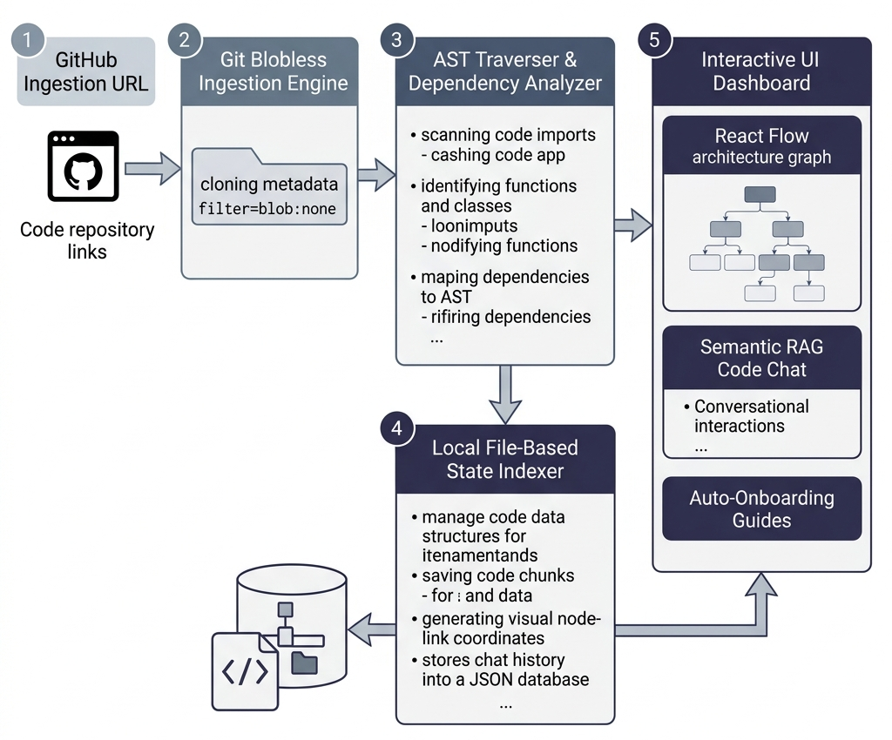

<h1 align="center">
  &nbsp;RepoGPT
</h1>

<p align="center">
  <strong>AI-Powered Repository Intelligence & Interactive Codebase Visualization Platform.</strong>
</p>

<p align="center">
  <a href="#-key-features">Key Features</a> •
  <a href="#-system-architecture">System Architecture</a> •
  <a href="#-codebase-directory-structure">Directory Structure</a> •
  <a href="#-getting-started-beginner-guide">Getting Started</a> •
  <a href="#-production-compilation--deployment">Deployment</a> •
  <a href="#-license">License</a>
</p>

---

## 📖 Introduction


RepoGPT is a premium developer-onboarding and codebase intelligence platform designed to eliminate code discovery friction. By pasting a public GitHub repository URL, the system clones, traverses, and parses the codebase locally using customized AST-signature extractors to generate comprehensive interactive charts, semantic document libraries, and context-aware chat interfaces.

It compiles code hierarchies in real time and interfaces directly with local LLMs (via Ollama) or falls back to a high-fidelity local semantic retrieval engine (TF-IDF + Cosine Similarity) when offline.

---

## 🚀 Key Features

*   **⚡ Real-Time Repository Ingestion:** Securely clones public Git repositories, automatically scans the folder structure, and generates dynamic metadata profiles (size, languages, file tree).
*   **🔍 AST-Signature Extraction Engine:** Recursively scans and parses source files across major ecosystems (JavaScript, TypeScript, Python, Java, Go, Rust, PHP) to map classes, function scopes, routes, libraries, and import/export structures.
*   **📊 Interactive Architecture Visualization:** Employs `@xyflow/react` to render interactive, zoomable codebase graphs in four distinct modes:
    *   *Overview (Concentric):* Folders group at the center with files orbiting.
    *   *File Tree:* A top-down hierarchical layout mapping file depth.
    *   *Imports & Dependencies:* Concentric rings mapping module imports.
    *   *Core Flows:* Service boundaries (API controllers, databases, middleware) mapped together.
*   **💬 Context-Aware Semantic Code Chat:** Converse with any parsed repository. It maps inputs against local code snippets using TF-IDF tokenization and cosine similarity to retrieve exact code context, piping the result through local LLMs or the fallback parser. Contains persistent quick suggested query pills right above the input bar.
*   **📖 Automated Developer Onboarding Guides:** Synthesizes developer manuals including setup walkthroughs, API reference tables, and architectural overviews.

---

## 🛠️ System Architecture

RepoGPT uses a highly optimized 5-stage ingestion pipeline to fetch and process repositories:



<details>
<summary>🔍 View Ingestion Pipeline Details</summary>

1.  **Git Blobless Clone**: Clones the repo with `--filter=blob:none` to download only metadata initially, fetching file contents on-demand.
2.  **Noise Exclusions**: Bypasses testing, documentation, and asset folders (`tests`, `docs`, `website`, `.github`) to speed up file walks.
3.  **AST Traverser**: Scans the files to parse imports, exports, functions, and class symbols.
4.  **Local Storage Store**: Saves the resulting repository map and chunks into JSON cache folders under `data/`.
5.  **Interactive Dashboard**: Displays file trees, React Flow diagrams, and semantic chat.
</details>

---

## 📂 Codebase Directory Structure

```text
RepoGPT/
├── data/                       # Local File-Based database (tracked files, chats, indices)
│   ├── indexes/                # AST and semantic search indices per repository
│   └── chats/                  # Saved RAG chat sessions
├── public/                     # Static media assets and branding elements
│   ├── Favicon.png             # Website Favicon
│   ├── Logo.png                # Primary transparent logo
│   └── system_architecture.png # Generated architecture diagram asset
└── src/
    ├── app/                    # Next.js App Router workspace
    │   ├── api/                # Fullstack API Endpoints
    │   │   ├── analyze/        # Ingests, clones, and parses repositories
    │   │   ├── chat/           # Routes RAG prompts to LLM / local retriever
    │   │   ├── docs/           # Dynamically synthesizes manuals
    │   │   ├── file/           # Safely streams source file contents
    │   │   └── visualize/      # Exposes parsed node and edge coordinates
    │   ├── dashboard/          # Multi-tab dashboard pages
    │   ├── globals.css         # Global styling and custom scrollbars
    │   ├── icon.png            # App icon source
    │   ├── layout.tsx          # Root HTML layout and metadata configurations
    │   └── page.tsx            # Interactive landing page with clone progress stepper
    ├── components/             # Premium animated Tailwind + Framer Motion components
    │   ├── BorderGlow.tsx      # Hover glow border wrappers
    │   ├── MagicRings.tsx      # Orbiting vector background elements
    │   ├── SplitText.tsx       # Character-staggered typography entrance animations
    │   └── Stepper.tsx         # Ingestion phase tracker
    └── lib/                    # Core modules and helper libraries
        ├── parser.ts           # AST traverser, symbol resolver, and summary compiler
        ├── rag.ts              # TF-IDF vectorizer, cosine similarity retriever, and Ollama adapter
        └── storage.ts          # File-based database read/write adapter
```

---

## 💻 Getting Started (Beginner Guide)

Follow these instructions to download, install, and run RepoGPT on your local machine.

### 1. Prerequisites
Ensure you have the following software installed:
1.  **Node.js (v18.x or newer)**: Essential to run the Next.js development server. Download it from [nodejs.org](https://nodejs.org/).
2.  **Git CLI**: Needed to clone the codebase and ingest target repositories. Download it from [git-scm.com](https://git-scm.com/). Ensure `git` is added to your environment `PATH`.
3.  **Ollama (Optional)**: If you want conversational AI chat capability powered by local LLMs. Download it from [ollama.com](https://ollama.com/).

---

### 2. Setup & Installation

Open your terminal (Command Prompt, PowerShell, or Terminal on macOS/Linux) and run:

```bash
# 1. Clone the project code
git clone https://github.com/jaymore4501/RepoGPT.git

# 2. Navigate into the cloned project folder
cd RepoGPT

# 3. Install all necessary dependencies
npm install
```

---

### 3. Running the Application

Once dependencies are installed, start the local development server:

```bash
npm run dev
```

Your terminal will print a local address (usually `http://localhost:3000`). Open this link in your web browser to access the RepoGPT landing page.

---

### 4. Setting up Conversational Chat (Ollama)

To interact with the codebase using conversational AI:
1.  Launch the **Ollama** app on your machine.
2.  Run the following command in a new terminal window to download and run the code-focused model:
    ```bash
    ollama run deepseek-coder
    ```
3.  Once the model is loaded, refresh your RepoGPT browser tab. The badge on the Chat page will change to **Ollama Active**.
4.  *Note:* If Ollama is offline or not installed, RepoGPT automatically falls back to **Fallback Mode** (using TF-IDF syntax extraction) to retrieve relevant files and details.

---

## 📦 Production Compilation & Deployment

To deploy RepoGPT or compile it for maximum performance:

### Local Production Server
Build the optimized production bundle and start the server:
```bash
# Build the application
npm run build

# Start the compiled bundle
npm run start
```
The server will start running on port `3000`.

### Vercel / Cloud Deployment
Since RepoGPT is a standard Next.js application, it can be deployed directly to Vercel or other cloud container providers (like Render, AWS, or Railway):
1.  Push your code repository to GitHub.
2.  Import the repository into Vercel.
3.  Vercel will automatically detect Next.js settings and build/deploy the application.
4.  *Note:* Because cloning and parsing happen on the server, ensure the hosting environment has access to a `git` binary and sufficient disk space to hold temporary cloned repositories under `temp_repos/`.

---

## 📄 License

**Proprietary & Closed-Source Software**

This project is licensed under a strict proprietary license. Copyright (c) 2026 RepoGPT. All rights reserved. 

No portion of this software may be copied, redistributed, publicly hosted, modified, or sublicensed without express prior written permission from the copyright owner. Unauthorized reproduction or copying violates national and international copyright law. See the [LICENSE](LICENSE) file for complete details.
