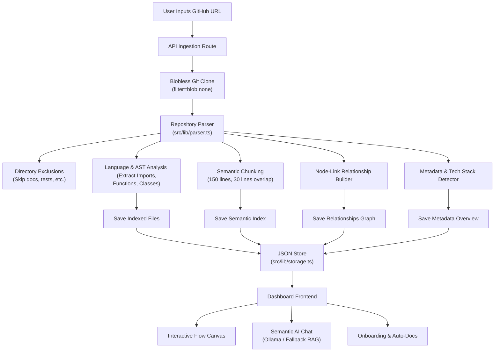

# RepoGPT System Overview

> **AI-Powered Repository Intelligence and Interactive Architecture Visualization Platform**

RepoGPT is a production-grade developer SaaS platform designed to ingest, parse, index, and visualize public GitHub repositories. By combining Abstract Syntax Tree (AST) parsing, directory structural walking, node-link graph mapping, and localized Retrieval-Augmented Generation (RAG), RepoGPT transforms dense codebases into interactive, queryable developer workspaces. 

The platform acts as a virtual "AI Senior Engineer," enabling developers to immediately onboard onto unfamiliar repositories, query code flow using natural language, and explore visual software architectures in real-time.

---

## 1. Primary Objectives
* **Eliminate Onboarding Friction**: Shorten developer ramp-up time by automatically extracting project purposes, technical workings, routing endpoints, and setup requirements.
* **Demystify Complex Architectures**: Turn abstract text codebases into interactive flow-graph diagrams representing internal modules, service integrations, and query channels.
* **Secure and Local-Ready Code Intel**: Empower developers to query codebases semantically without forced subscriptions or uploading proprietary data structures to third-party cloud engines, with native local LLM fallback bridging.
* **Automate Manual Auditing**: Provide immediate document generation, package dependency mapping, and complexity insights on demand.

---

## 2. Platform Architecture & Data Flow

RepoGPT is built on a modern Next.js stack, using dynamic serverless routing matched to an offline-first JSON-based state indexing store. Below is a high-level representation of the ingestion pipeline:

🔍 View Text-Based Mermaid Diagram Flow

### Ingestion Pipeline Stages
1. **Blobless Git Cloning**: Rather than executing slow full clones, RepoGPT performs a shallow clone with `--filter=blob:none`. This downloads only files metadata at checkout and loads actual file contents lazily on-demand when read by the parser. This cuts ingestion bandwidth by up to 90%.
2. **Noise Directory Exclusion**: Before traversing file trees, the recursive walker checks directory sub-paths against optimized exclusions (`docs`, `test`, `specs`, `examples`, `website`, etc.). This stops unnecessary checks on secondary files, improving parser speeds by several orders of magnitude.
3. **AST Symbol Resolution**: The parser scans source files (JS, TS, Python, Go, Rust, Java, C++, PHP) extracting exports, imports, class declarations, and function modules.
4. **Link-Node Dependency Mapping**: Discovered imports are resolved to project-relative files, building a node-link visualization representation map where files represent nodes and imports represent directed graph links.
5. **Semantic Indexing**: Files are chunked using a sliding window algorithm (150 lines per chunk, 30 lines overlap) and stored inside a local indexing mapping for fast semantic/keyword lookup.

---

## 3. Core Features

### 🔍 Interactive Architecture Graph
* Powered by `React Flow`, it maps codebase relationships into customizable web-canvas graphs.
* Automatically distinguishes core components, database files, routers, middleware, and logic files.
* Allows pan, zoom, and node searches, showing file summaries on-click.

### 💬 Conversational Semantic Chat
* An interactive chat copilot that answers questions about the codebase structure.
* Supports **Ollama** locally, auto-connecting to user models like `deepseek-coder`, `llama3`, or `mistral`.
* Falls back gracefully to localized keyword/vector mapping if Ollama is offline.
* Provides persistent suggested query capsules right above the input bar for easy template testing.

### 📄 Developer Document Generator
* Renders instant developer onboarding manuals, setup instructions, REST route tables, and API documentation based on structural scanning.

### 📊 Repository Tech Profile
* Detects tech stacks automatically (Node.js, Next.js, Django, FastAPI, Go, Rust, Java, Laravel).
* Calculates language usage percentages and displays repository complexity ratings.

---

## 4. Methodology & Algorithms

### Code Chunking Strategy
To ensure context-aware AI retrieval, files are chunked as follows:
* **Size**: 150 lines per chunk (prevents LLM token overflow while retaining contextual code blocks).
* **Overlap**: 30 lines (ensures continuity of functions and class structures splitting across boundaries).
* **Identifier Format**: `${relativePath}:${startLine}-${endLine}` for precise file references.

### Semantic Search & Retrieval
When a user queries the semantic chat:
1. **Local Retrieval (Fallback)**: Calculates keyword overlap and matching coefficients against index chunks, ranking chunks containing the highest density of matching symbols, functions, or imports.
2. **Ollama Retrieval**: If Ollama is online, queries are processed using contextual codebase chunks injected into the system prompt to guide LLM synthesis:
   $$\text{Score}(c, q) = \sum_{t \in q} \text{TF-IDF}(t, c) \cdot \text{Priority}(c)$$

---

## 5. Technical Specifications

| Component | Technology | Role |
| :--- | :--- | :--- |
| **Framework** | Next.js 16 (App Router) | Core platform runtime & serverless endpoints |
| **Styling** | Vanilla CSS + Tailwind | Fluid UI components, glassmorphism dashboard |
| **State & Store** | Node fs + JSON Store | Local indexing and cache layer (`src/lib/storage.ts`) |
| **Graphing Engine** | React Flow | Interactive node-link canvas rendering |
| **Markdown Parser** | Marked | Dynamic rendering of AI responses |
| **Language Icons** | Lucide React | Visual state identifiers |

---

## 6. Analysis & Evaluation

### Advantages
> [!TIP]
> **Performance Optimization**: By omitting binary blobs during git checkout and excluding large test suites, ingestion times are minimized.
* **100% Client-Safe**: Integrates with local Ollama APIs, ensuring zero external code storage or corporate data leakage.
* **Dual-Mode Reliability**: The local keyword matching fallback ensures functionality even without GPU-accelerated environments.
* **Premium UX/UI**: The interface features sleek glassmorphism, visual stepper states, and responsive layouts.

### Disadvantages
> [!WARNING]
> **Static Parsing Boundaries**: Codebase mapping uses AST regex scans. Dynamic operations like database triggers or reflection APIs are not trace-mapped.
* **Resource Intensive**: Running heavy local models in Ollama requires appropriate CPU/GPU system resources.
* **Public Git Restriction**: Only works with publicly accessible GitHub URLs by default (private repositories require pre-configured SSH keys or credentials).

---

## 7. Future Roadmap
1. **Private Repository Authentication**: Add OAuth2 integration to allow secure analysis of private workspaces.
2. **3D WebGL Visualization**: Migrate architecture graphs to Three.js force-directed networks to accommodate large enterprise repositories.
3. **Write-Back Agent Capabilities**: Enable developers to request automated refactoring and pull-request creation directly from the chat.
4. **CI/CD Integration**: Provide a RepoGPT GitHub Action to generate static documentation sites automatically during builds.

---

## 8. Conclusion
RepoGPT bridges the gap between text-based codebases and developer mental models. Through optimized cloning, structured directory mapping, and local semantic intelligence, the platform allows developers to analyze, visualize, and interact with complex software projects. Whether used for onboarding or code audits, RepoGPT serves as a secure, local-first workspace for repository intelligence.
